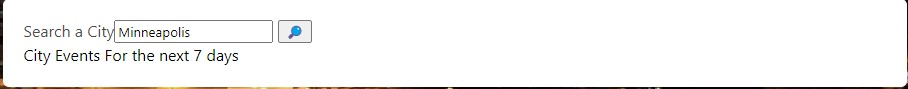
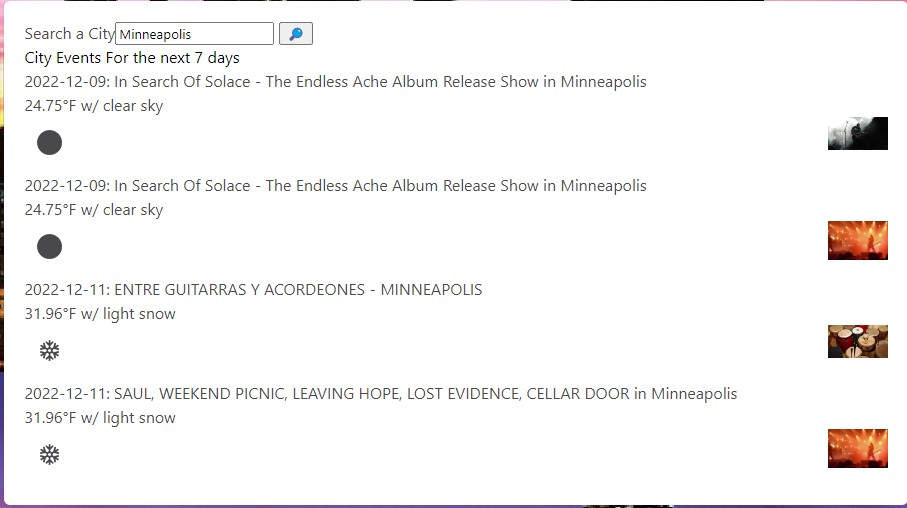
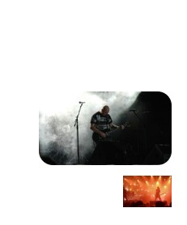

# Evenster

## Table of Content 
- [Introduction](#Introduction)
- [Installation](#Installation)
- [Usage](#usage)
- [License](#license)

## Introduction
Evenster was created to allow the user to input in a city and receive a list of events and the weather in and around the area. THe user is able to input any city around the United States. The events are then pulled through the 3rd party API; Ticketmaster and displayed to the user. Alongside ticketmaster this page aso uses The Weather API and it displays the weather alongside the events. This project allowed us to use what we were taught in class over the past 6 weeks. That included HTML, JavaScripts, CSS, and APIs. This project also allowed us to be able to work together as a group to complete tasks and resolve issues. 

## Installation

There are no steps required for installation. The users open the webpage on A web browser application.

## Usage
The user is able to open this with any web browser of their choice. Once they open it they will be presented with a search bar at the top of the page.

Once on the home page the use is able to input a city of their choosing: 

when they search the user will get a list of events in that city alongside the weather.

The user will also be able to hover over the image on the side and the image will enlarge.

## License 

MIT License

## Deplyed Link

https://salenaoneill.github.io/eventster/

